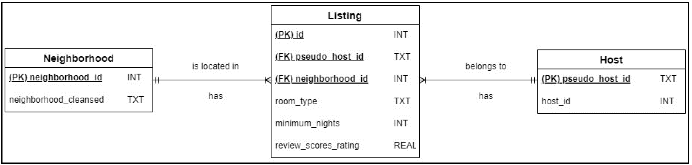
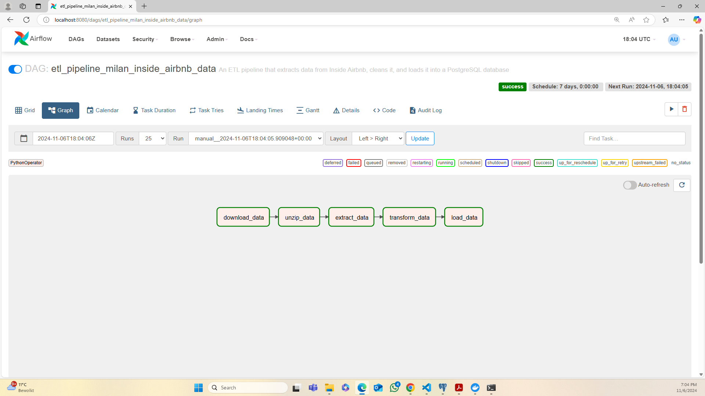
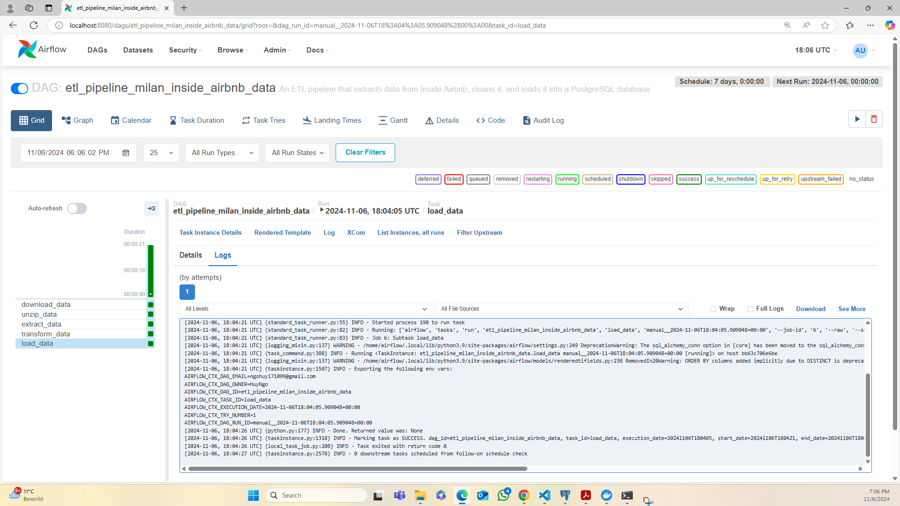
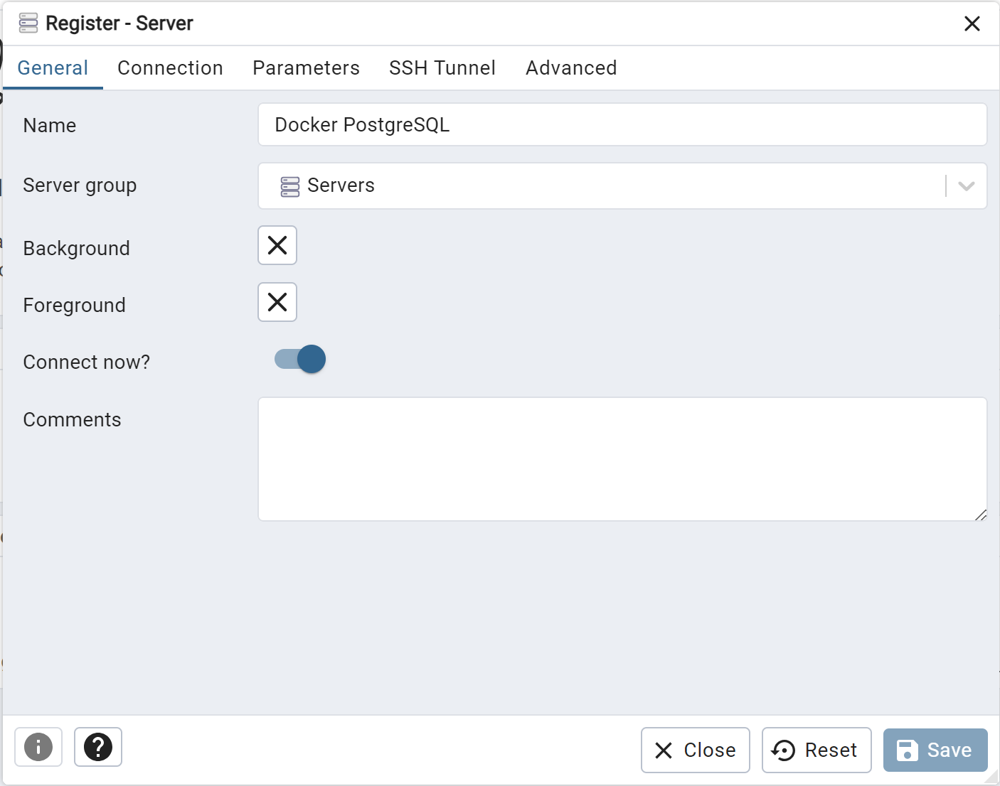
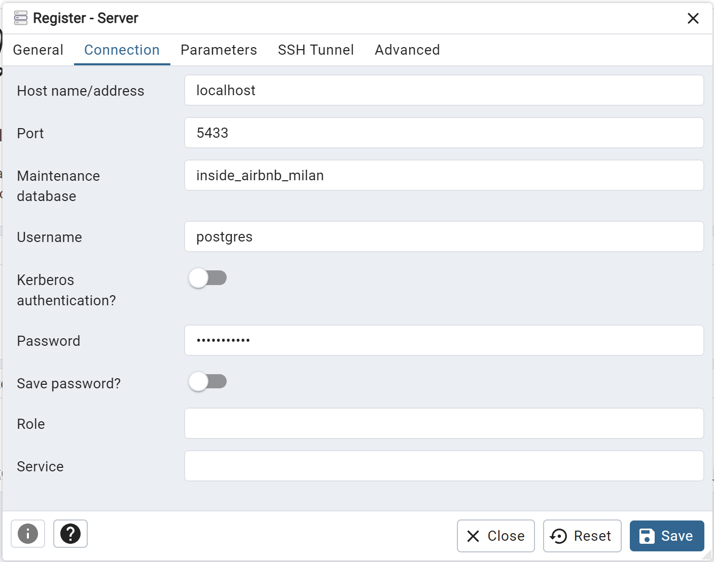
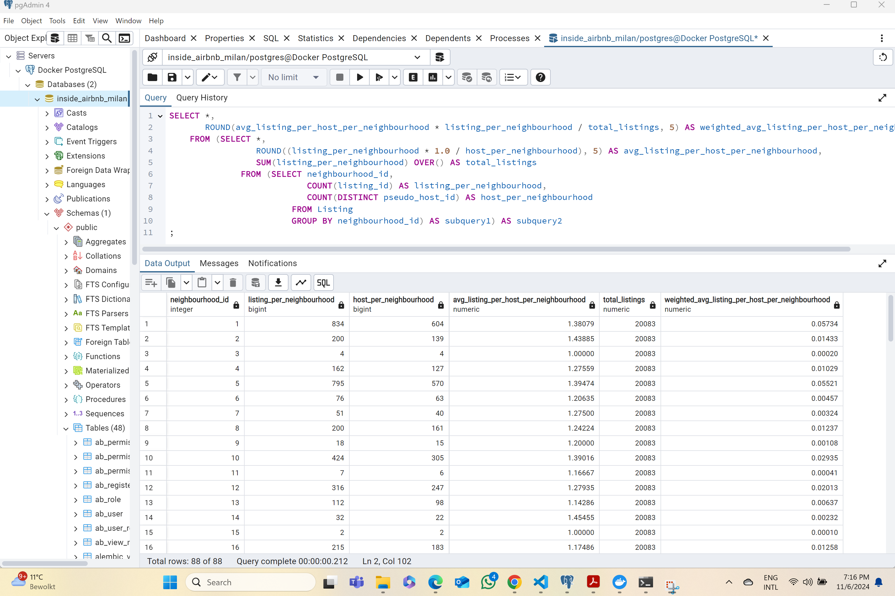
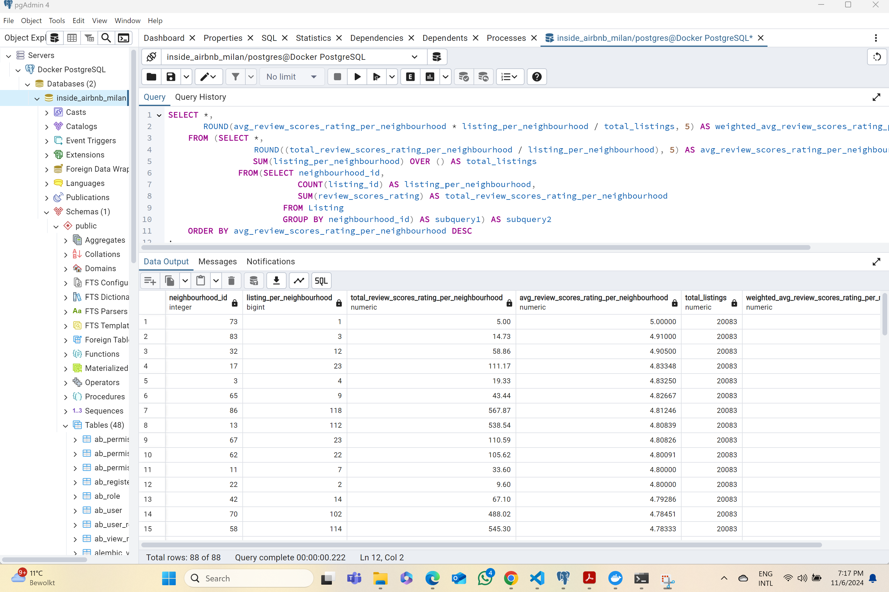
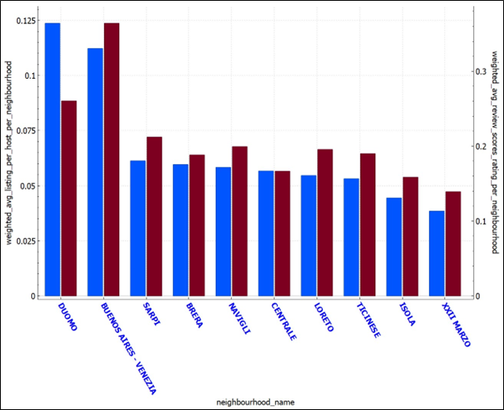

# Milan's Airbnb Rental Market Analysis

## Project Overview

This project provides Milan's government officials with insights into the distribution of short-term Airbnb rentals across the city's popular neighborhoods. The goal is to inform policy that could help mitigate Milan's housing crisis by reducing the prevalence of short-term rentals, thus making housing more affordable for residents.

## Tools and Languages

- **Tools**: Docker Compose, Apache Airflow, and PostgreSQL (pgAdmin)
- **Languages**: Python and SQL

## Key Tasks:

- **ERD Design**: Designed a relational database schema using **normalization principles** (1NF, 2NF, and 3NF).
- **Data Extraction**: Downloaded a compressed CSV file from Inside Airbnb's website directly. 
- **Data Transformation**: Cleaned and transformed data using **Python** by selecting relevant columns, renaming, removing NA and duplicate values, refining categorical data, and filtering outliers.
- **Data Loading**: Loaded the data into a **PostgreSQL** database. CSV exports of the data were saved for local storage as backups.
- **Data Visualization**: Queried the **PostgreSQL** database and generated simple visualizations to summarize key insights.
- **Workflow Management**: Coordinated the entire ETL process using **Apache Airflow** for reliable data extraction, transformation, and loading.
- **Containerization**: Containerized the project with **Docker Compose** for easy deployment in a production environment.

## Running The Project

### Prerequisites

- Docker and Docker Compose installed
- PostgreSQL and pgAdmin installed
- Python 

### Installation and Setup

1. **Clone The Repository**

   ```sh
   git clone https://github.com/HuyNgo171099/Inside-Airbnb-Milan-Pipeline
   cd Inside-Airbnb-Milan-Pipeline

2. **Set Up Docker for PostgreSQL and Airflow Services**

   ```sh
   docker-compose up --build db schema airflow-init airflow-webserver airflow-scheduler

3. **Access the Airflow Webserver GUI**: Navigate to `localhost:8080` in your browser.

4. **Set Up Docker for Query Service**

   ```sh
   docker-compose up --build query

5. **Set Up pgAdmin Connection**: Configure pgAdmin to connect to the PostgreSQL database on `localhost:5433`.

## Project Background

Founded in 2008, Airbnb is a popular platform allowing users to rent short-term accommodations worldwide. However, the rise of Airbnb has sparked concerns over its impact on local housing markets, particularly the potential for increased rent prices due to long-term rentals being converted to short-term listings. The US Economic Policy Institute (2019) noted that short-term rentals can reduce long-term housing availability, thereby increasing residential rent prices.

Milan has felt the strain of this phenomenon, especially following an influx of foreign residents due to Italy's 2017 tax incentives. Milan’s housing market, already facing pressure from high rental costs, now sees additional challenges from Airbnb listings. With over 17,000 active short-term lets, Milan has one of the highest Airbnb densities in Italy, second only to Rome (The Local Italy, 2023). As a result, Milan's government is considering regulations to reduce short-term rentals and make housing more affordable.

This project aims to give Milan’s government officials an overview of the distribution of short-term rentals across the city’s most popular neighborhoods. Hopefully, this insight will serve them well in drafting the terms of the regulation aiming to reduce the number of Airbnb short-term rentals and in doing so, maximize its effectiveness in addressing the city’s housing crisis and improving the subsistence of residents. To achieve this objective, the project aims to find the answer to the following question: *“What are the proportions of short-term rentals per room type in the top 10 neighborhoods with the highest weighted average number of listings per host and the highest weighted average review rating score?”*. 

## ERD Design

- **Entity Identification**: Key entities include **Listing**, **Neighborhood**, and **Host**.
- **Relationships and Associated Cardinalities**: **Listing** has a one-to-many (1:m) relationship with **Host**. That is, a listing belongs to one and only one host, but a host can have one to many listings. Similarly, **Listing** has a one-to-many (1:m) relationship with **Neighborhood**. That is, a listing is located in one and only one neighborhood, but a neighborhood can have one to many listings.
- **Variables of Interest**: The six variables of interest are *id, host_id, neighbourhood_cleansed, room_type, minimum_nights, and review_scores_rating*.
- **Sensitive Data Protection**: Pseudonymization is used to replace the column *host_id* with the column *pseudo_host_id* because the column *host_id* contains personal data that can be used to retrieve information about a data subject or in this case, the identity of a particular host.   
- **Normalization**: The original table containing the six relevant variables is already in the 1NF as all columns are single-valued. The table is also in the 2NF as there is no partial dependency. Moreover, the table is also in the 3NF since there is no transitive dependency. Nevertheless, I decide to separate this table into three tables, namely **Listing**, **Host**, and **Neighborhood** because the separation will help reduce redundancy (some listings are hosted by the same host or located in the same neighborhood) and make it easier for future maintenance and updates (if I need to modify information about hosts, listings, and neighborhoods, I can do so in each respective table without affecting unrelated data and in doing so, reducing data inconsistency). 
- **The Final ERD**:
    

## ETL Pipeline

### Extract Stage

- **Data Extraction**: Downloaded a compressed CSV file of Milan listings from Inside Airbnb: `'https://data.insideairbnb.com/italy/lombardy/milan/2024-06-22/data/listings.csv.gz'`. 

### Transform Stage

- **Columns Renaming**: Renamed the column *id* to *listing_id* and the column *neighborhood_cleansed* to *neighborhood_name*. 
- **Data Duplication**: Removed duplicate rows.
- **Outliers Analysis**: Removed rows where *review_scores_rating* was 0, as they fell outside the valid range (1–5).
- **Missing Values**: Replaced missing values in *review_scores_rating* with the mean. 

### Load Stage

1. Created the **Neighbourhood** table. This table has two columns, *neighbourhood_id* and *neighbourhood_name*. *neighbourhood_id* is the primary key. The function SERIAL is used so that PostgreSQL can automatically create and assign an identification number to each neighborhood in a sequential order.

2. Created the **Real_host** table containing the real identification numbers (*host_id*), the **Mapping_UUID** table mapping the real identification numbers (*host_id*) to their hexadecimal representations (*pseudo_host_id*), and the **Pseudo_host** table containing only the hexadecimal representations (*pseudo_host_id*). In the event of unauthorized access to the **Pseudo_host** table, malicious actors cannot use these hexadecimal representations to deduce information about specific host identities. 

3. Created the **Listing** table. This table has six columns, *listing_id*, *pseudo_host_id*, *neighbourhood_id*, *room_type*, *minimum_nights*, and *review_scores_rating*. *listing_id* is the primary key. *pseudo_host_id* is the first foreign key that is used to reference the parent key with the same name *pseudo_host_id* in the parent table **Pseudo_host**. *neighbourhood_id* is the second foreign key that is used to reference the parent key with the same name *neighbourhood_id* in the parent table **Neighbourhood**.

4. After the necessary tables were created, they were populated using data from the cleaned **listings** table. 

5. The population of the **Neighbourhood** table was relatively straightforward. 87 unique neighborhood names were extracted from **listings** and put into the column *neighbourhood_name* in **Neighbourhood**. The identification numbers were automatically generated by PostgreSQL. 

6. The population of the **Real_host** table happened in the same manner. 14,413 unique identification numbers of the hosts were extracted from **listings** and put into the column *host_id* in **Real_host**. Then, **Mapping_UUID** was populated by mapping each host’s identification number to its corresponding hexadecimal representation. Finally, **Pseudo_host** was populated by extracting the hexadecimal representations from **Mapping_UUID** and putting them into the column *pseudo_host_id* in **Pseudo_host**. 

7. The population of the **Listing** table was, however, quite complicated. First, **listings** needed to be joined with **Neighbourhood** to replace *neighbourhood_name* in **listings** with *neighbourhood_id* in **Neighbourhood** and with **Mapping_UUID** to replace *host_id* in **listings** with *pseudo_host_id* in **Pseudo_host**. This joined table was then used to populate **Listing**. 

## Orchestrating the ETL Pipeline with Apache Airflow

After executing the ETL pipeline with Apache Airflow, I verified successful task completion via the Airflow webserver GUI. By mapping Docker’s internal port 8080 to my local port 8080, I accessed the GUI at `localhost:8080` in my browser.

- **DAG Overview**: Airflow uses Directed Acyclic Graphs (DAGs) to collect tasks, organize them with dependencies and relationships to specify how they should run. The image below depicts the DAG of this project. The green border lines indicate that all the tasks are executed successfully. 

    

- **Task Logs**: While green border lines on the Airflow webserver GUI indicate successful task completion, it is important to check task logs to verify success, especially if try-except blocks are used in the script. The task log provides precise success or error information. The image below displays the load task log, which shows a successful run with no errors, confirming that the entire ETL pipeline executes smoothly.

    

## Connecting to the Database with pgAdmin

After the ETL process, I accessed the populated PostgreSQL database `inside_airbnb_milan` using pgAdmin. The setup requires:
- **Name**: `Docker PostgreSQL`
- **Host name/address**: `localhost`
- **Port**: `5433`
- **Maintenance database**: `inside_airbnb_milan`
- **Username**: `postgres`
- **Password**: `your_password`





After the successful connection to the database, I wrote four advanced SQL queries to generate the insights that would help me address the project’s research question (these queries are available in the `SQL_Query.py` script). These queries can also be executed directly in pgAdmin, as shown below:





## Main Findings

Among Milan’s 87 neighborhoods, the top 10 with the highest weighted average number of listings per host and review scores include Duomo, Buenos Aires - Venezia, Sarpi, Brera, Navigli, Centrale, Loreto, Ticinese, Isola, and XXII Marzo. “Entire home/apt” listings dominate across both long-term and short-term rentals, while “Private room,” “Hotel room,” and “Shared room” listings are less common. Short-term rentals are prevalent across all room types, though some neighborhoods (e.g., Centrale, Isola, and Navigli) show higher proportions of long-term “Entire home/apt” rentals.

### Policy Implications

- Regulations designed to curtail the proliferation of Airbnb short-term rentals warrant consideration, particularly in the identified neighborhoods. These neighborhoods exhibit the highest weighted average number of listings per host, signifying a concentrated presence of short-term Airbnb rentals. Furthermore, their distinguished status, marked by the highest weighted average review rating scores, suggests they are favored among tourists, likely due to their central locations — a facet acknowledged within the review rating scores under the “location” category. Consequently, the introduction of regulations targeting Airbnb short-term rentals in these areas could yield a profound impact on the reduction of housing prices and rents. 

- Entire home or entire apartment Airbnb short-term rentals should be the main category of focus because this category is prevalent in both short-term and long-term rentals across the neighborhoods. Certain terms in the regulations could specifically be used to address this category to restrict the number of homes or apartments for short-term rentals in the market to decrease their renting prices.


